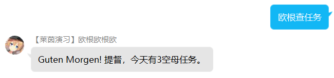

# Smart QQ Java Kancolle Version

这是基于 [ScienJus/smartqq](https://github.com/ScienJus/smartqq) 制作的一个自用的，主题为 **舰队Collection** 机器人。

## 现有功能

- 自动聊天回复 。

  当收到特定消息的时候，机器人会从 3 句台词中自动选择 1 句进行回复。

  

- 整点报时功能。

  每到整点的时候，机器人都会发送特定报时语音。

- 简单的查询Kancolle日常特殊日期任务

  

- 能自动从[kcwiki官推转发](https://t.kcwiki.moe/)转发新的官推，也可以手动查询最新的官推

  

- 内置的一个Roll程序，使用方法是发送群信息包含"Roll"、"欧根"以及一个或多个数字。

  

- Cosplay 功能，现在你不修改代码就能更改机器人的台词，并且支持扩展。

  

  

  


## 使用方法

配置好MAVEN环境后，Clone该项目，以Application.java为运行入口运行，使用一个 QQ 小号登陆即可。

或者下载已经编译好的 jar 文件，使用 `java -jar smartqq.jar` 指令运行。


## 机器人指令

### 群聊

以下指令只需要在一句话中包含这几个关键字即可，并且英文关键字忽视大小写。

- 查询特殊指令任务：`<称呼> + 任务`
- 查询最新官推：`<称呼> + 官推`
- Roll 点数：`<称呼> + roll + 一个或多个数字`
- 查询 Cosplay 列表：`<称呼> + cosplay列表`
- Cosplay 角色：`<称呼> + cosplay + 角色数字`


### 私聊

- 刷新群列表：`刷新群列表`
- 刷新xml文件解析：`xml`
- 查询 Cosplay 列表：`cosplay列表`
- Cosplay 角色：`cosplay + 角色数字`


## 自定义角色

在项目根目录找到 `stringKancolle.xml`文件，打开。


​	 

```xml
 <?xml version="1.0" encoding="UTF-8"?>

<kancolle>

	 <role>001</role> <!-- 默认角色的代号 -->

	 <character id="001" name="Prinz Eugen"> <!-- 角色代号以及名称 -->
	 <at>欧根</at> <!-- 两个称呼 -->
	 <at2>老婆</at2>
	 <call1>Einen schönen Tag.</call1> <!-- 三种回复 -->
	 <call2>哇，吓了我一跳！…啊是！出击！</call2>
	 <call3>提督！莱茵演习吗！…啊什么啊不是啊…没关系，我会加油的！交给我吧！</call3>
	 <inf>舰队的情报啊，嗯，稍等哦，哦，哦哦，原来如此呐～ </inf> <!-- 获取官推的回复 -->
	 <flush>提督~成功刷新了。</flush>
	 
	 <!-- 角色的报时 -->
	 <time0>哇哇！？正好0点啦！今天是我欧根亲王担任报时娘的角色呢。好，明白啦！交给我吧！</time0>		 
	 <time1>凌晨1点到啦！以这样的元气的感觉来说吗？啊，是吗，太好啦！</time1>
	 <time2>凌晨2点。这个国家称此时为“ushi…mitsu…doki”…吗？啊，总觉得这个短语的发音好有趣呢。</time2>
	 <time3>哇，吓了我一跳。啊，很在意我这个发型吗？啊啊，已经凌晨3点啦！</time3>
	 <time4>嗯嗯～～，凌晨4点了，嗯嗯～～不管怎么说是有些困了…但是，没关系的！</time4>
	 <time5>5点到啦！早上好，好舒服的早晨呢！加油干吧！</time5>
	 <time6>6点了呢。该吃早饭了啊…诶，我来做？明，明白了，交给我吧！嗯，做什么吃呢。俾斯麦姐姐的一份也要做吧，对吧♪～</time6>
	 <time7>好，今天的早饭是面包。奶酪和香肠哦。还有沙拉和…当然，热乎乎的咖啡啦！/r/n 虽然普通但是很美味吧♪～啊，现在正好7点整。</time7>
	 <time8>8点啦。来吧，Admiral先生，开始今天的作战吧！从演习开始？还是说远征？</time8>
	 <time9>早上9点了。嗯？啊，是长门啊！喂♪～长～门♪～…嗯？在哪儿遇见的？那当然是～\r\n …嗯…诶？在，在哪儿来着…</time9>
	 <time10>10点了。战列舰？没问题！和俾斯麦姐姐在一起的话，完～全不用全力就能击沉呢！交给我吧♪～</time10>
	 <time11>午前11点啦♪～差不多该吃午饭了呢。今天的话，在外面吃也挺好的呢。</time11>
	 <time12>啊啊，已经中午了！正午了呢！午饭的话，在外面吃吃奶酪加面包也不错吧？心情好的话啤酒也来一发吗♪～啊，不行啊…</time12>
	 <time13>13点了。午后作战开始了呢、加油干吧！</time13>
	 <time14>14点了。诶，什么什么，酒匂？啊啊，我知道，那只可爱的轻巡吧。</time14>
	 <time15>15点了。啊，这个吗？是的，这是“瑟布鲁斯”行动作战时的舰装。怎么样，合适我吧♪～</time15>
	 <time16>16点了。哇，吓我一跳，是俾斯麦姐姐♪～我们一起出击吧！嗯，一定哦！</time16>
	 <time17>17点了。到黄昏了呢。差不多，今天的太阳也要落下了呢。…哇，漂亮的天空…啊啊，当然俾斯麦姐姐才是最漂亮的♪～</time17>
	 <time18>18点了。我去准备晚饭了。今天吃生冷食品怎么样？诶，不要？温热的食物比较好？</time18>
	 <time19>19点了。那么，晚饭我试着做了德国猪肘子加浓汤。汤里透出的味道不错吧？\r\n 最后，在其中加入米饭如同杂烩一样非常美味哦♪～</time19>
	 <time20>20点到了。日本的重巡们也过的非常的充实呢。嗯嗯，嗯～原来如此…嗯、嗯…</time20>
	 <time21>21点了。诶，我有什么拿手好戏？嗯，让我想想，曾经，我用舰炮好好的教训了一群蜂拥而至的坦克。这个我出人意料的很在行呢！对！</time21>
	 <time22>完全已经是晚上了呢，22点了。Admiral先生，今天一天的作战真是辛苦您了！</time22>
	 <time23>23点了。嗯～～差不多我也要去休息了呢…晚安…诶，不行吗？</time23>
	 <quest1>Guten Morgen! 提督，今天有5补给舰任务。</quest1>
	 <quest2>Guten Morgen! 提督，今天有3空母任务。</quest2>
	 <quest3>Guten Morgen! 提督，今天没有日期尾数特殊任务。</quest3>
	 <roll>提督，你输入的数字有不在范围内的。（1~100）</roll>
 	 </character>
    
 </kancolle>
```
每个 character 部分为一个角色的所有台词，所以增加角色只需要类似的在最后的一个 `</character>` 和 </kancolle> 中插入新的角色即可。


## 需要的改进

- 更多的功能实现，欢迎 pr,fork,star
- 用栈实现获取多条更新的官推
- 单元测试